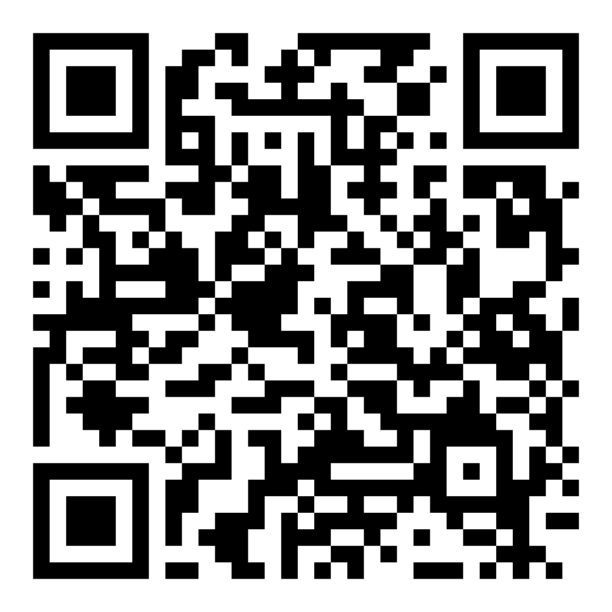

# Sample projects using Three.js

Here it is the list of sample projects using [Three.js](https://github.com/mrdoob/three.js){:target="_blank"} library:

Sample | Description | Test it
:----------: | :---------: | :---:
**Image tracking demo** | Detect and track a sample marker image.  | 
**Surface tracking demo** | Place an object 2m away at north and track it with device motion sensors (gyroscope) | 

