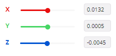

# Spatial tracking demo

Access the experience through the following [link](https://onirix-ar.github.io/threejs/spatial-tracking/) or by scanning the QR Code below with your phone's camera:

 

The experience will load by scanning the box of [*Through The Ages: A New Story of Civilization*](https://czechgames.com/en/through-the-ages/).

This experience is thought to be interacted with as if the box where laid on a table and you where looking at it from the front. An image on a screen would make you see the experience as if you where above the box and you would not see the content properly. However, you can use [this image](box.png) on a flat, horizontal surface if you want to try out the experience and do not have the game's box. 

In order to be able to accurately place objects inside the experience's coordinate system you can use Onirix's editor. If you place the objects there beforehand you can copy their position and orientation:

 

> Note: Spatial tracking is generally considered more applicable to environments (spaces) rather than objects. However, we have supplied an example featuring an object to facilitate a more effective testing experience.

## Model Information:
* title:	JULIUS CAESAR - PHRYGIE TURKEY
* source:	https://sketchfab.com/3d-models/julius-caesar-phrygie-turkey-f97f4c2629124b3fa8f5499aeac393db
* author:	Arqueomodel3D (https://sketchfab.com/juanbrualla)

Model License:
* license type:	CC-BY-NC-4.0 (http://creativecommons.org/licenses/by-nc/4.0/)
* requirements:	Author must be credited. No commercial use.