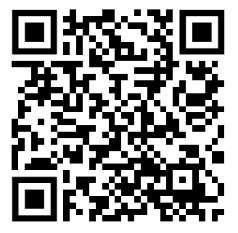

# Surface tracking portal (Van Gogh's Room)

Access the experience through the following [link](https://onirix-ar.github.io/threejs/surface-tracking-portal/) or by scanning the QR Code below with your phone's camera:

## Preview

## How to create the portal effect

### From your 3D editor, build a occlusion mesh around your model with an opening for the portal

Example with Blender + Custom Props:

https://user-images.githubusercontent.com/3604774/229633654-eab279af-cd79-47a0-a93d-bbdfc4d7a784.mp4

### From code, find the occlusion mesh and set its 'colorWrite' property to false:

This will make the mesh to render transparent while occluding other objects:

        model.traverse((object) => {
            if (object.isMesh) {
                if (object.userData.occlusion) {
                    object.material.colorWrite = false;
                    object.material.side = THREE.DoubleSide;
                }
            }
        });

## Model info

Original model at [Sketchfab](https://sketchfab.com/3d-models/camera-limits-demo-van-gogh-bedroom-in-arles-daefab319a584e559443e39ff05e84fa).
